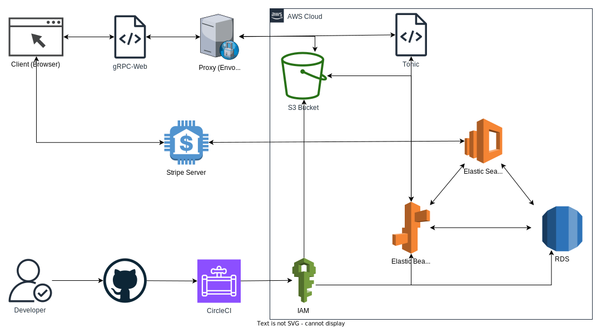
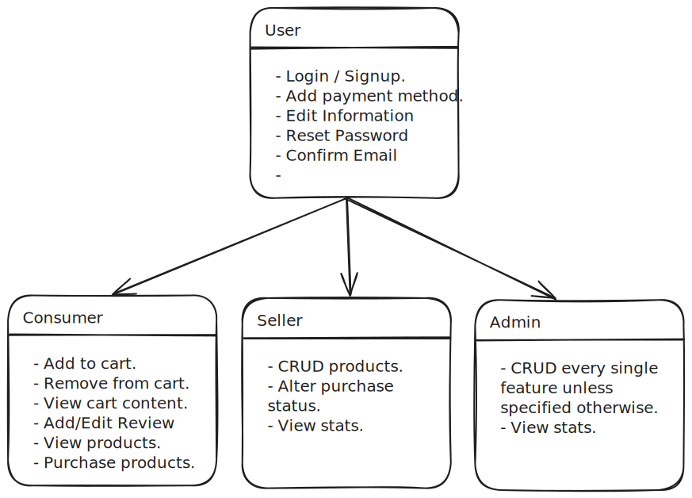
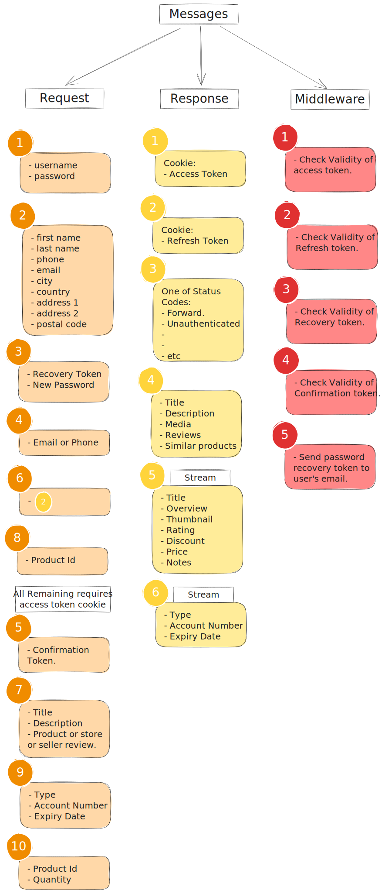
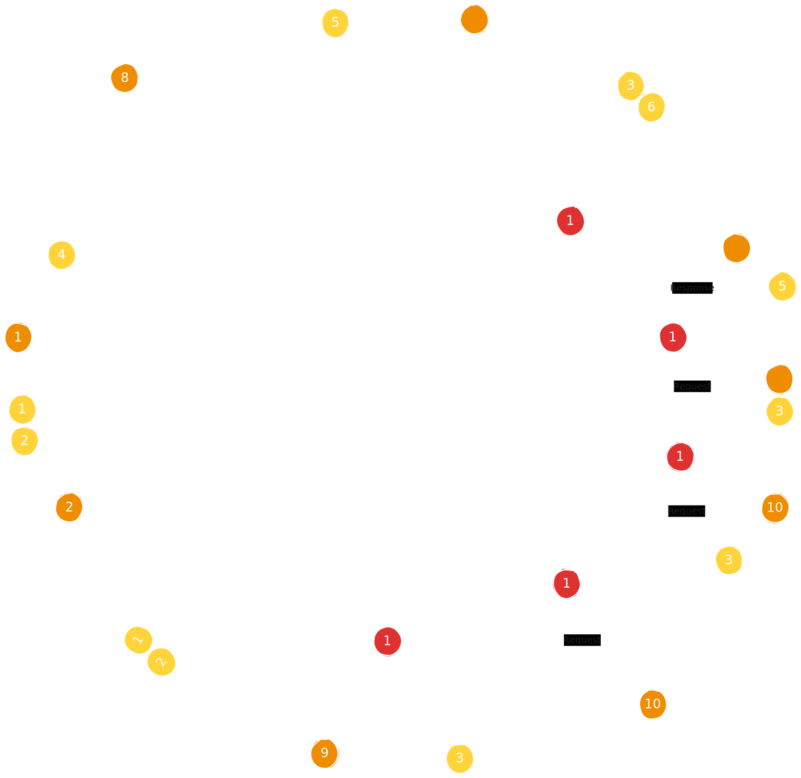
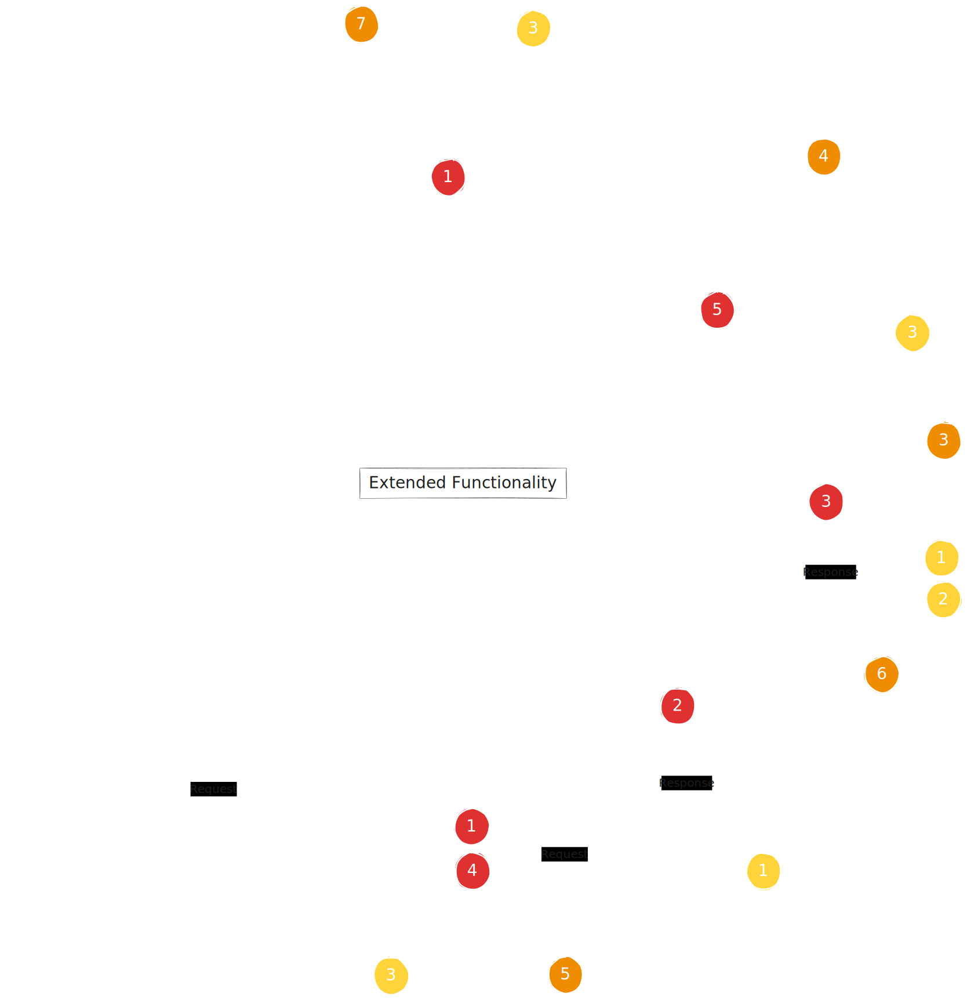
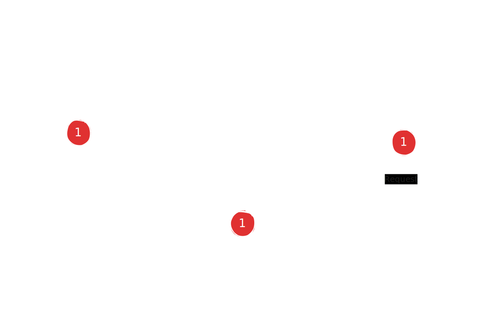
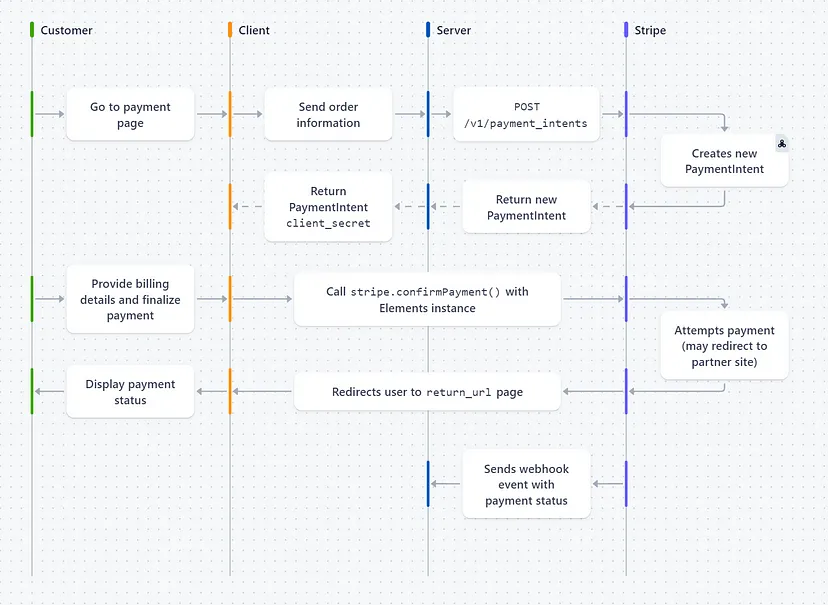

# Tech Stack and Architecture

Explore the technology stack and architectural blueprint that fuels the marketplace application.

## Tech Stack

The application relies on a state-of-the-art tech stack for optimal performance:

- Rust (Backend)
- React.js (Frontend)
- Tonic (gRPC framework)
- SQLx (Database client)
- Stripe (Payment processing)
- Meilisearch (Search engine)

## Architecture Diagram

The architecture diagram offers an overview of how these technologies collaboratively shape the marketplace platform.

# API Design

> **_DISCLAIMER:_**
> API Design was subject to substantial change during development. The following diagrams are such scratches on a white paper in order to organize the thought process. Thankfully, Protocol Buffers are very scalable and easy to modify to accommodate demands. Finally, it's very recommended to just check out the proto definitions; it's declarative and intuitive.

## Functionality Diagram

## API Flow Diagram

Trace the trajectory of requests and responses within the API, offering clarity on the data flow throughout the system.

#### Messages

#### Consumer Services

#### Consumer Services (Continued)

#### Seller Services (To Be Implemented)

## Payment Process

Source: [Stripe Integration with React & Flask | by Felix Pitterling | Medium](https://medium.com/@f.pitterling/stripe-integration-with-react-flask-e7aac635b139)

# Database Design (ERD

The ERD diagram showcases relationships between different entities in the database, ensuring data integrity and coherence.

